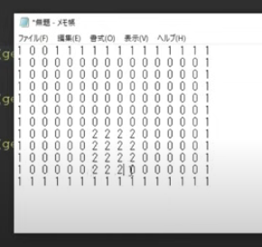

This summary is based on RyiSnow's java game fundamentals.

# 1. The Mechanics

## Main Class
Main Package, Main Class;

In Main Class, at Main Method, create a window with:

    public class Main {

    JFrame window = new JFrame(); 

Then, we add the functionality to close the window by pressing X with:
  
    window.setDefaultClosingOperation(JFrame.EXIT_ON_CLOSE);

We block resizing the window with:

    window.setResizable(false);

Add name to the window:

    window.setName("Name of your game");

Do not specify the location of the window, and will be rendered at the center of the screen:

    window.setLocationRelativeTo(null);

Make it visible:

    window.setVisible(true);

## GamePanel Class
We define some game screen settings here

GamePanel extends JPanel

    public class GamePanel extends JPanel { 

We set the gameTile Size and a scaler multiplier to make it look decent in higher resolutions:

    final int originalTileSize = 64;
    final int scale = 3;
    public final int tileSize = originalTileSize * scale;

To define the **size of screen**, we define the number of **columns** and **rows** of these tiles. Let's create the public variables to be used in our TileManager later. In this example we use a 4x3 ratio:

    public final int maxScreenCol = 16;
    public final int maxScreenRow = 12;
    
    public final int screenWidth = tileSize * maxScreenCol;
    public final int screenHeight = tileSize * maxScreenRow;

We set a constructor to JPanel and add a preferred size to the JPanel and set a optional background color:

    setPreferredSize(new Dimension(width, height);
    setBackground(Color.Black);

Setting a DoubleBuffer will make all the drawing of this component to be painted in a separate buffer offscreen:

    setDoubleBuffered(true);

We add the GamePanel to the Main class and pack it, which will cause the window in Main to be resized to fit the preferred size and layouts of its subcomponents:

    public class Main {
        ...
        GamePanel gamePanel = new GamePanel();
        window.add(gamePanel);
        window.pack;

# 2. Game Loop and Key Inputs

The Thread is the mechanism that will run constantly and update the game in a loop. We create it in Game Panel.

    Thread gameThread;

To run a Thread, the GamePanel class will implement Runnable:

    public class GamePanel extends JPanel implements Runnable {

Because of that, we have to implement the obligatory methods of the Runnable interface:

    @override
    public void run() {}

Everytime that we **start** the Thread, that run() method will be called;
We created the Thread object before (gameThread). Now let's create a method to start it up. We instantiate our gameThread and pass (this), meaning this GamePanel class, as an arg:

    public void startGameThread() {
        gameThread = new Thread(this)
        gameThread.start();
    }
Everytime this method is called, our gameThread is going to start and the run() method will be executed. 
We will make the run() execute while the Thread is alive.

    public void run() {
        while (gameThread.isAlive()) {}

The run() will update the informations and draw the screen in a infinite loop.
The paintComponent() method is a native JPanel method to draw the screen.
We pass the Graphics class as an argument to paintComponent(). The Graphics class has many functions to draw objects on screen.
The paintComponent() method has to call the JPanel's paintComponent() method with the graphics object we passed.
The Graphics acts as our pencil, and we'll convert it to Graphics2D that extends the Graphics class. This is because Graphics2D gives us more sophisticated control over geometry, coordinate transformations, color management and text layout;

    public void update();
    public void paintComponent(Graphics graphics) {
        super.paintComponent(graphics);
        Graphics2D graphics2D = (Graphics2D) graphics;
    

Now the run() can implement these two methods. The repaint() is a native callback to the paintComponent() method:

    public void run() {
        while (gameThread.isAlive()) {
        update();
        repaint();
    }

In the paintComponent() we can for example set a color, draw a rectangle and fill it with said color:

    graphics2D.setColor(Color.white);
    graphics2D.fillRect(x, y, width, height);
    graphics2D.dispose(); // good practice to save memory

## KeyHandler Class
The class to handle the key inputs

The KeyHandler class implements KeyListener, that is a listener interface for receiving keyboard events (keystrokes). It has three inherited abstract methods:
We will only use keyPressed and keyRelease

    public class KeyHandler implements KeyListener {    
        @Override
        public void keyTyped(KeyEvent e) {}
        @Override
        public void keyPressed(KeyEvent e) {}
        @Override
        public void keyReleased(KeyEvent e) {}
    }

We use `getKeyCode` to return the Integer Keycode associated with the key pressed event:

    public void keyPressed(KeyEvent e) {
        int keyCode = e.getKeyCode();
    }

With this, we can map if the directional buttons (WASD) are pressed or released and add a true or false value to it.
We can also add a `directionalKeyPressed` to use in diagonal movement.

    if (code == KeyEvent.VK_W) {
        upPressed = true;
        directionalKeyPressed = true;
    }
    if (code == KeyEvent.VK_S) {
        downPressed = true;
        directionalKeyPressed = true;
    }
    if (code == KeyEvent.VK_A) {
        leftPressed = true;
        directionalKeyPressed = true;
    }
    if (code == KeyEvent.VK_D) {
        rightPressed = true;
        directionalKeyPressed = true;
    }

Diagonal movement uses 2 keys instead of one. If releasing one key stops the animation, diagonal movement wouldn't be possible, so we make sure all directional movement has stopped to cease movement animation:

    if (!leftPressed && !downPressed && !upPressed && !rightPressed) {
        directionalKeyPressed = false;
    }

## GamePanel Class
Now we have to instantiate our KeyHandler in GamePanel and add it in its constructor.
Also we ste the focus on the GamePanel to receive the key inputs.

    public KeyHandler keyHandler = new KeyHandler();

    public GamePanel() {
        ...
        this.addKeyListener(kehHandler);
        this.setFocusable(true);
    }

Now with keys, we can create player position variables, the pixel speed movement we want to be moved in each update, and set these position variables in the paintComponent() player position.

    int playerPositionX = 100;
    int playerPositionY = 100;
    int playerSpeed = 4;

    public void paintComponent(Graphics graphics) {
        ...
        graphics2D.fillRect(playerPositionX, playerPositionY, width, height);

And we can map the movements to the key events:

    if (keyHandler.upPressed) playerPositionY -= speed;
    if (keyHandler.downPressed) playerPositionY += speed;
    if (keyHandler.leftPressed) playerPositionX -= speed;
    if (keyHandler.rightPressed) playerPositionX += speed;

### FPS
#### Sleep Method
Now we have to limit the speed of the updating down to a fixed FPS value. After that, we'll use the FPS factor to sleep our Thread every given time, in our case, the FPS (60) divided by 1000000000 (the number of nanoseconds per second), that is 0,016 Nanoseconds. 
The game will update every 0,016 seconds. To do that, we get the current time and get the time that will be after 0,016 nanoseconds, and update only on that marks.
We convert the nanoseconds to milliseconds because that's what the Sleep() uses.

    public void run() {
  
        double drawInterval = 1000000000 / FPS;  
        double nextDrawTime = System.nanoTime() + drawInterval;
          
        while (gameThread.isAlive()) {
    
            update(); 
            repaint();
        
            try {
                double remainingTime = nextDrawTime - System.nanoTime();
                remainingTime = remainingTime/1000000;
                if (remainingTime < 0) remainingTime = 0;
                Thread.sleep((long) remainingTime);
                nextDrawTime += drawInterval;
            } catch (InterruptedException e) {
                throw new RuntimeException(e);
            }
        }
    }

#### Delta Method
Uses an internal counter to determine the next update time, without sleeping.

    double drawInterval = 1000000000 / FPS;
    double delta = 0;
    long lastTime = System.nanoTime();
    long currentTime;
    
    while (gameThread.isAlive()) {
    
        currentTime = System.nanoTime();
        delta += (currentTime - lastTime) / drawInterval;
        lastTime = currentTime;
    
        if (delta >= 1) {
            update();
            repaint();
            delta--;
        }
    }

# 3. Sprites and Animation

We create an Entity package and Entity class, that will be the parent of all "living" entities in the game.
The basic variables that everyone will use (Player, Enemies and NPCs) are stated here.

    package br.com.soaring.entity;
  
    public class Entity {
        public int worldPositionX, worldPositionY, movementSpeed;
    }

Then create Player Class inside the Entity package. It imports the GamePanel and KeyHandler classes:

    package br.com.soaring.entity;
    
    import br.com.soaring.main.GamePanel;
    import br.com.soaring.main.KeyHandler;

    public class Player extends Entity {
        GamePanel gamePanel;
        KeyHandler keyHandler;
    
        public Player(GamePanel gamePanel, KeyHandler keyHandler) {
            this.gamePanel = gamePanel;
            this.keyHandler = keyHandler;
        }
    }

In the GamePanel class, we instantiate a Player class:

    public class GamePanel extends JPanel implements Runnable {
        ...
        Player player = new Player(this, keyHandler);

The Player variables and methods that we had before in GamePanel can be moved to the player class now:

    public class Player extends Entity {

        ...
      
        public void setDeafultValues() {
            int playerPositionX = 100;
            int playerPositionY = 100;
            int playerSpeed = 4;
        }
      
        public void update() {
            if (keyHandler.upPressed) playerPositionY -= speed;
            if (keyHandler.downPressed) playerPositionY += speed;
            if (keyHandler.leftPressed) playerPositionX -= speed;
            if (keyHandler.rightPressed) playerPositionX += speed;
        }
      
        public void paint(Graphics2D graphics2D) {
            graphics2D.setColor(Color.white);
            graphics2D.fillRect(x, y, width, height);
        }

And now the update function in GamePanel only has "player.update()":

    public class GamePanel extends JPanel implements Runnable {
        ...
        public void update() {
        player.update();
    }

## Resources Package

We create a Resources Package (res) to store the graphical and sound resources.
Then we add some BufferedImages to our Entity class. BufferedImage describes an Image with an accessible buffer of image data.

    public class Entity {

        ...
    
        public BufferedImage up1, up2, upIdle, down1, down2, downIdle, left1, left2, leftIdle, right1, right2, rightIdle;
        public String direction;

Now with images, in the Player class we can fetch them. Right before update, we create a method for getting the player images.

    public class Player extends Entity {

        ...
    
        public void getPlayerImage() {
            try {
                up1 = ImageIO.read(getClass().getResourceAsStream("../res/player/player_up_1.png"));
                up2 = ImageIO.read(getClass().getResourceAsStream("../res/player/player_up_2.png"));
                upIdle = ImageIO.read(getClass().getResourceAsStream("../res/player/player_up_idle.png"));
                down1 = ImageIO.read(getClass().getResourceAsStream("../res/player/player_down_1.png"));
                down2 = ImageIO.read(getClass().getResourceAsStream("../res/player/player_down_2.png"));
                downIdle = ImageIO.read(getClass().getResourceAsStream("../res/player/player_down_idle.png"));
                left1 = ImageIO.read(getClass().getResourceAsStream("../res/player/player_left_1.png"));
                left2 = ImageIO.read(getClass().getResourceAsStream("../res/player/player_left_2.png"));
                leftIdle = ImageIO.read(getClass().getResourceAsStream("../res/player/player_left_idle.png"));
                right1 = ImageIO.read(getClass().getResourceAsStream("../res/player/player_right_1.png"));
                right2 = ImageIO.read(getClass().getResourceAsStream("../res/player/player_right_2.png"));
                rightIdle = ImageIO.read(getClass().getResourceAsStream("../res/player/player_right_idle.png"));
            } catch (IOException e) {
                e.printStackTrace();
            }
        }

    public void update() {
    ...

Then we can call the method on the start of the class and update the default direction to "down"

    public Player(GamePanel gamePanel, KeyHandler keyHandler) {
        ...
        getPlayerImage();
    }

    public void setDefaultValues() {
        ...
        direction = "down";
    }

Then we also update the changing directions according to which key was pressed:

    public void update() {

        if (keyHandler.upPressed) direction = "up";
        if (keyHandler.downPressed) direction = "down";
        if (keyHandler.leftPressed) direction = "left";
        if (keyHandler.rightPressed) direction = "right";

With that, we can now check the direction every frame and add the corresponding image to be drawn in a variable:

    public void draw(Graphics2D graphics2D) {

        BufferedImage image = null;
    
        switch (direction) {
            case "up":
            image = up1;
            break;
            case "down":
            image = down1;
            break;
            case "left":
            image = left1;
            break;
            case "right":
            image = right1;
            break;
        }

    graphics2D.drawImage(image, playerPositionX, playerPositionY, gamePanel.tileSize, gamePanel.tileSize, null)

## Animation

We create a `spriteCounter` and `spriteNumber` in Entity.

    public class Entity {
        ...
        public int spriteCounter = 0;
        public int spriteNumber = 1;

Then, in `Player` Class, we can use them to animate the sprite. The `spriteCounter` will add up each frame. We can decide the threshold on which the spriteCounter will change the `spriteNumber` variable that will be the one to determine which sprite will be rendered.
So now the image rendering will have extra conditions:

    switch (direction) {
        case "up":
        if (spriteNumber == 1) image = up1;
        if (spriteNumber == 2) image = upIdle;
        if (spriteNumber == 3) image = up2;
        if (spriteNumber == 4) image = upIdle;

And inside the `update()` we add the counter to change the sprites according to the frames:

    if (keyHandler.directionalKeyPressed) {
        spriteCounter++;
        if (spriteCounter > 6) {
            switch (spriteNum) {
            case 1:
            spriteNum = 2;
            break;
            case 2:
            spriteNum = 3;
            break;
            case 3:
            spriteNum = 4;
            break;
            case 4:
            spriteNum = 1;
        }
        spriteCounter = 0;
    }

# 4. Drawing Tiles

We create a new package named `tile`, and inside the `res` package, we create another package named `tiles`.
In the package `tile`, we crate the class `Tile`:

    package br.com.soaring.tile;
    
    import java.awt.image.BufferedImage;
    
    public class Tile {
        public BufferedImage tileImage;
        public boolean collision = false;

Then a class called "TileManager":

    package br.com.soaring.tile;
    
    public class TileManager {

        GamePanel gamePanel;
        public Tile[] tiles;
          
        public TileManager(GamePanel gamePanel) throws IOException {
        this.gamePanel = gamePanel;

Now to buffer the tile types we have (grass, sand, wall, etc...) we have to create an array and a method to feed that array with our tile files This is temporary, just to show creating and rendering three tiles:

    public TileManager(GamePanel gamePanel) throws IOException {
        ...
        tiles = new Tile[10];
        getTileImage();
    }
    
    public void getTileImage() {
        try {
            tiles[0] = new Tile();
            tiles[0].tileImage = ImageIO.read(getClass().getResourceAsStream("../res/tiles/grass1.png"));
        
            tiles[1] = new Tile();
            tiles[1].tileImage = ImageIO.read(getClass().getResourceAsStream("../res/tiles/wall1.png"));
        
            tiles[2] = new Tile();
            tiles[2].tileImage = ImageIO.read(getClass().getResourceAsStream("../res/tiles/water1.gif"));

        } catch (IOException e) {
            e.printStackTrace();
        }
    }

Now we have to add a `draw()` in the `TileManager`, and add a call to it in our `GamePanel`'s `paintComponent()`. **The `paintComponent()`works in layers. We draw the bottom and background stuff first, then the top and foreground stuff last**.

    public class GamePanel extends JPanel implements Runnable {
        ...
        TileManager tileManager = new TileManager(this);
        ...

        public void paintComponent(Graphics graphics) {
            ...
              
            tileManager.draw(graphics2D);
            player.draw(graphics2D);
              
            ...
            
        }
    }

Just to show off the three tiles example, the `TileManager`'s `draw()` method will render them. Remember, they stand at 64 pixels apart:

    public void draw(Graphics2D g2) {
        graphics2D.drawImage(tiles[0].tileImage, 0, 0, gamePanel.tileSize, gamePanel.tileSize, null);
        graphics2D.drawImage(tiles[1].tileImage, 64, 0, gamePanel.tileSize, gamePanel.tileSize, null);
        graphics2D.drawImage(tiles[2].tileImage, 128, 0, gamePanel.tileSize, gamePanel.tileSize, null);
    }

Now to automate the tile rendering, using a **loop**. This will render a map inside the limits of columns and rows we have, but only using the grass tile. Moving maps will be addressed later.

    public void draw(Graphics2D graphics2) {
      
        int col = 0;
        int row = 0;
        int x = 0;
        int y = 0;
          
        while (col < gamePanel.maxScreenCol && row < gamePanel.maxScreenRow) {
            
            graphics2D.drawImage(tile[0].image, x, y, gamePanel.tileSize, gamePanel.tileSize, null);
            col++;
            x += gamePanel.tilesize;
            
            if (col == gamePanel.maxScreenCol) {
                col = 0;
                x = 0;
                row++;
                y += = gamePanel.tileSize;
            }
        }
    }

To render diferent tiles, we will **import a text file containing the tile coordinates and types;
In our exemple, the map will have 16 numbers per row (columns), and 12 lines (rows):

Now create another package names `maps` inside our **res** folder.
We put our map files there.
After that, in `TileManager` we add an array for housing the information that we'll extract from the map file:

    public class TileManager {
        ...   
        public int[][] mapTileCoordinates;

Then, instatiate the counter with the maximum Column and Row sizes:

    public TileManager(GamePanel gamePanel) throws IOException {
        ...
        this.mapTileCoordinates = new int[gamePanel.maxWorldCol][gamePanel.maxWorldRow];
        getTileImage();
        loadMap("../res/maps/large_map.txt");
    }

Now we will create that `loadmap()` method. In it, we'll use the **InputStream** to import the file and **BufferedReader** to read the file.

    public void loadMap(String filePath) throws IOException {
        try {
            InputStream inputStream = getClass().getResourceAsStream(filePath);
            BufferedReader bufferedReader = new BufferedReader(new InputStreamReader(inputStream));
            
            int column = 0;
            int row = 0;
        
            while (column < gamePanel.maxWorldCol && row < gamePanel.maxWorldRow) {
        
                String line = bufferedReader.readLine();
            
                while (column < gamePanel.maxWorldCol) {
            
                    String[] rowTiles = line.split(" "); // split the line around the given expression (" ");
                    int retrievedTile = Integer.parseInt(rowTiles[column]);
                    mapTileCoordinates[column][row] = retrievedTile;
                    column++;
                }
    
                if (column == gamePanel.maxWorldCol) {
                    column = 0;
                    row++;
                }
            }
            
            bufferedReader.close();
                
        } catch (Exception e) {
            e.printStackTrace();
        }
    }

Now to render the file we had stored:

    public void draw(Graphics2D graphics2D) {
    
        int worldCol = 0;
        int worldRow = 0;
        int screenX = 0;
        int screenY = 0;
    
        while (worldCol < gamePanel.maxWorldCol && worldRow < gamePanel.maxWorldRow) {
            int tileUnit = mapTileCoordinates[worldCol][worldRow]; // fetching the tile unit of the line and column;
        
            graphics2D.drawImage(tiles[tileUnit].tileImage, screenX, screenY, gamePanel.tileSize, gamePanel.tileSize, null);
        
            worldCol++;
            screenX += gamePanel.tileSize;
        
        
            if (worldCol == gamePanel.maxWorldCol) {
                worldCol = 0;
                screenX = 0;
                worldRow++;
                screenY += gamePanel.tileSize;
            }
        }
    }

# 5. World and Camera

We had screensized maps and the player moving around them. Now we will upgrade to large scaled maps bigger than the screen and the player will be centered on screen.

## Player

We can set the starting position of ou player in the world map.
In this example, he is positioned 23 tiles right and 21 down;

    public void setDefaultValues() {

        worldPositionX = gamePanel.tileSize * 23;
        worldPositionY = gamePanel.tileSize * 21;

To position the player at the center of the screen, we add these values on the Player class.

    public class Player extends Entity {

        public final int playerScreenPositionX, playerScreenPositionY;

Player position is located at the center of the screen, that being, the half length of width and height. We subtract half tile because the drawing is maed from left to right and from up to down, so it was starting at the top left corner;

    public Player(GamePanel gamePanel, KeyHandler keyHandler) {

        ...
        
        playerScreenPositionX = gamePanel.screenWidth / 2 - (gamePanel.tileSize / 2);
        playerScreenPositionY = gamePanel.screenHeight / 2 - (gamePanel.tileSize / 2);

These `playerScreenPositionX` and `playerScreenPositionY` will remain constant during the game. To do that, will change the player screen position in the `Player.draw()` method:

        graphics2D.drawImage(image, playerScreenPositionX, playerScreenPositionY, gamePanel.tileSize, gamePanel.tileSize, null);

## GamePanel

Now we establish our World data. Our example map will be 50 tiles large.

    // WORLD SETTINGS
    public final int maxWorldCol = 50;
    public final int maxWorldRow = 50;
    public final int worldWidth = tileSize * maxWorldCol;
    public final int worldHeight = tileSize * maxWorldRow;

## TileManager

We change the iterators of the `mapTileCoordinates` from Screen to World columns:

    this.mapTileCoordinates = new int[gamePanel.maxWorldCol][gamePanel.maxWorldRow];

### Camera Function

From `TileManager.draw()` we delete the previous `screenX`, `screenY`, ` screenX += gamePanel.tileSize;`, `screenX = 0;` and `screenY += gamePanel.tileSize;`. 
Then we create 4 new variables and change the X and Y in `TileManager.draw()` with the new `screenX` and `screenY`.
Being the player our reference to center the screen, and being the top left corner of the screen the value 0X and 0Y of screen, we determine what is drawn **relative to the screen** by subtracting the player position value.
Example:
A tile of coordinate x800 and y0 is clearly far right in the first row. So, if the player is x500 and y500, this tile should be drawn 300 pixels offscreen to the left of the player screen and 500 pixels also offscreen above the player screen.
But remember, the screen values are the top left corner, and the player is actually at the center of the screen, so to make the player be the reference of the calculation, not the corner, we add the `playerScreenPosition` to offset the calculation.

    int worldX = worldCol * gamePanel.tileSize;
    int worldY = worldRow * gamePanel.tileSize; 
    int screenX = worldX - gamePanel.player.worldPositionX + gamePanel.player.playerScreenPositionX;
    int screenY = worldY - gamePanel.player.worldPositionY + gamePanel.player.playerScreenPositionY;

Now to **optimize** the rendering, we will make sure only tiles **onscreen** are rendered.
We create a conditional to test the boundaries of our screen, by verifying if a tile to be rendered is inside the player screen vertically (`player.worldX` on the center of the screen with the `player.screenX` being his left margin and the oposite value being his right margin) and horizontally.
But to add a extra tile of distance in each margin, to guarantee that we will not see the margin of the rendering onscreen, we add an extra `gamePanel.tileSize` to each calculation.

    private boolean isTileInRangeOfPlayer(int worldX, int worldY) {
        return
        worldX + gamePanel.tileSize > gamePanel.player.worldPositionX - gamePanel.player.playerScreenPositionX 
        &&
        worldX - gamePanel.tileSize < gamePanel.player.worldPositionX + gamePanel.player.playerScreenPositionX 
        &&
        worldY + gamePanel.tileSize > gamePanel.player.worldPositionY - gamePanel.player.playerScreenPositionY 
        &&
        worldY - gamePanel.tileSize < gamePanel.player.worldPositionY + gamePanel.player.playerScreenPositionY;
    }

    if (isTileInRangeOfPlayer(worldX, worldY)) {
        graphics2D.drawImage(tiles[tileUnit].tileImage, screenX, screenY, gamePanel.tileSize, gamePanel.tileSize, null);
    }

# Collision Detection

